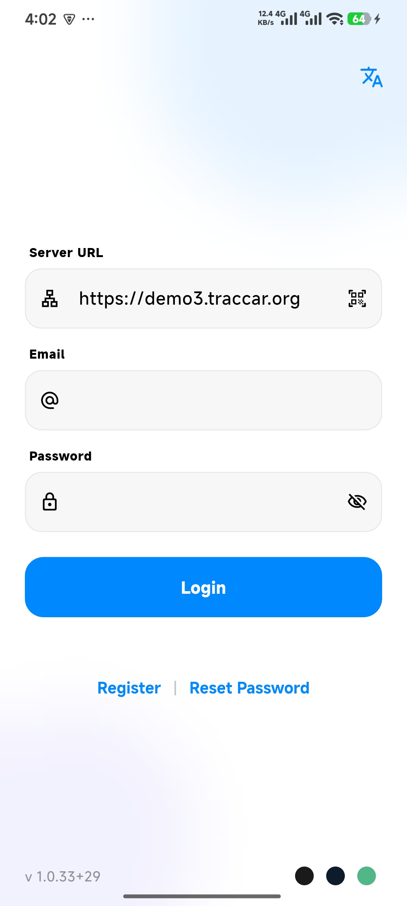
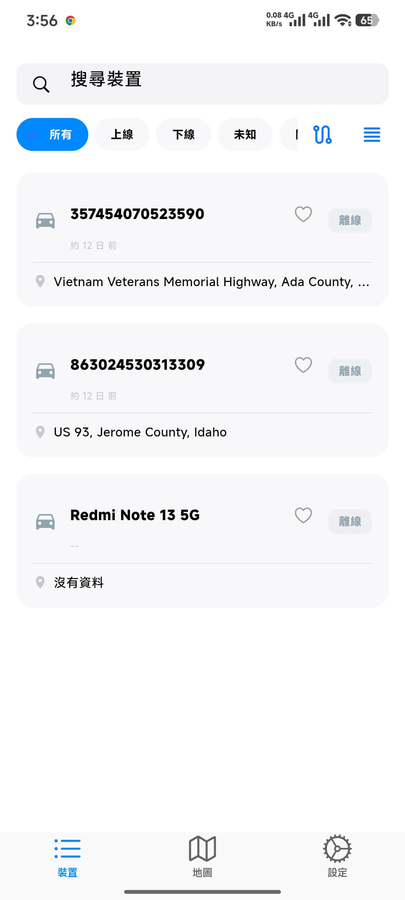
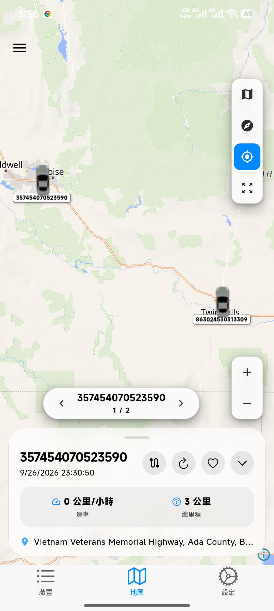
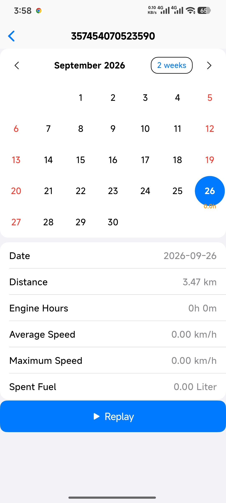
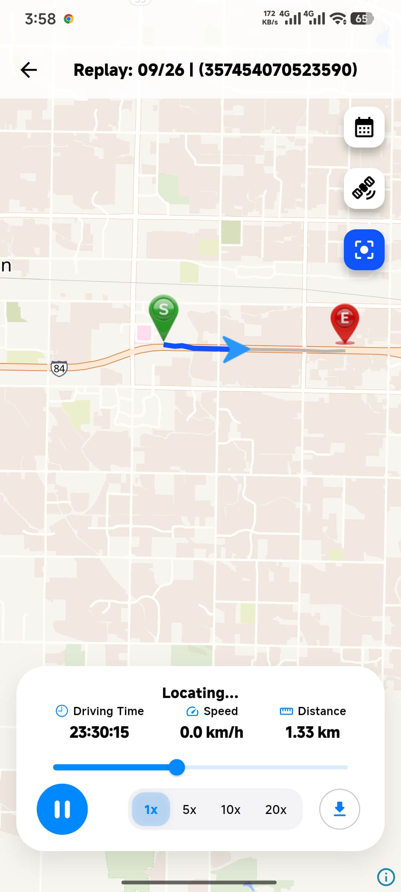
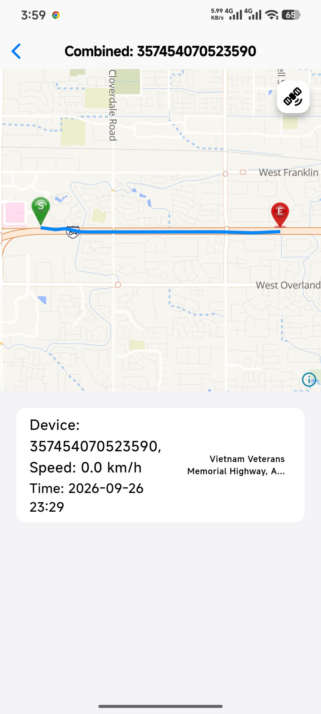
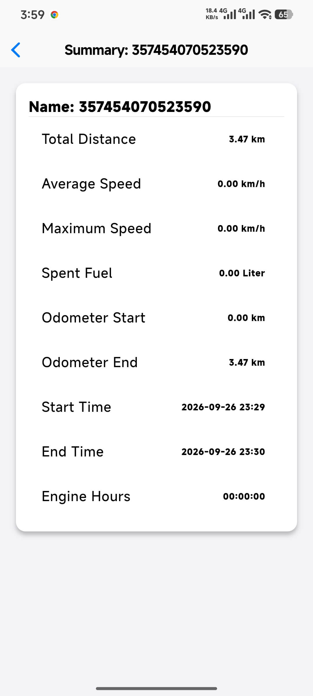
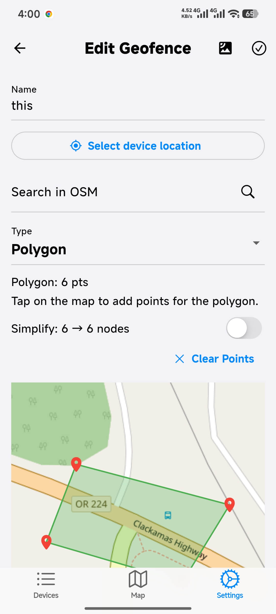
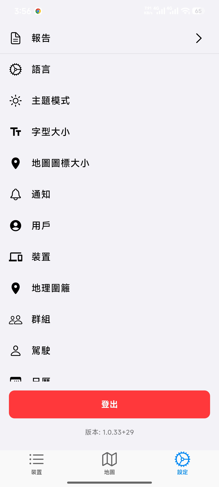
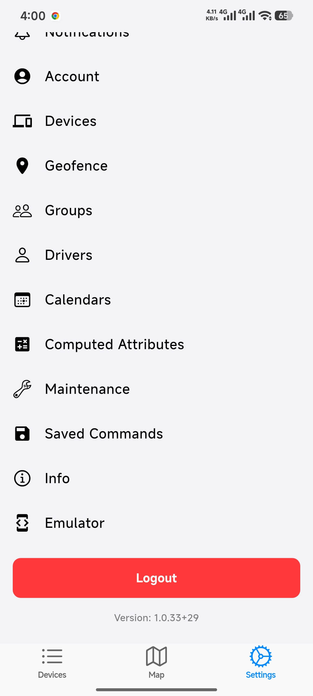

<p align="center">
  
</p>

<h1 align="center">Trabc</h1>

<p align="center">
  <b>Tracbc GPS tracking client with open-source maps</b><br>
  <sub>No Google services · No proprietary libraries · No ads · No trackers</sub>
</p>

<p align="center">
  <a href="https://github.com/onethings/trabc_fdroid/releases/tag/v1.0.34">
    
  </a>
</p>

<p align="center">
  <a href="https://github.com/onethings/trabc_fdroid/releases/latest"></a>
  
  
  <a href="LICENSE"></a>
  <a href="https://www.traccar.org/"></a>
</p>

---

## 📸 Screenshots

<p align="center">
  <a href="images/1.jpg"></a>
  <a href="images/2.jpg"></a>
  <a href="images/3.jpg"></a>
  <a href="images/4.jpg"></a>
  <a href="images/5.jpg"></a>
  <a href="images/6.jpg"></a>
  <a href="images/7.jpg"></a>
  <a href="images/8.jpg"></a>
  <a href="images/9.jpg"></a>
  <a href="images/10.jpg"></a>
</p>

---

## ⬇️ Download & Install

Get **v1.0.34** from the [GitHub Release page](https://github.com/onethings/trabc_fdroid/releases/tag/v1.0.34)
(or browse [all releases](https://github.com/onethings/trabc_fdroid/releases)).

| APK                                                                                                                                | Best for                              | Size   |
| ---------------------------------------------------------------------------------------------------------------------------------- | ------------------------------------- | ------ |
| [**app-arm64-v8a-release.apk**](https://github.com/onethings/trabc_fdroid/releases/download/v1.0.34/app-arm64-v8a-release.apk)     | Almost every phone from ~2016 onwards | ~18 MB |
| [**app-armeabi-v7a-release.apk**](https://github.com/onethings/trabc_fdroid/releases/download/v1.0.34/app-armeabi-v7a-release.apk) | Older 32-bit devices                  | ~18 MB |
| [**app-x86_64-release.apk**](https://github.com/onethings/trabc_fdroid/releases/download/v1.0.34/app-x86_64-release.apk)           | x86_64 emulators / tablets            | ~19 MB |

Not sure which one you need? Pick **arm64-v8a** — it covers virtually all modern
Android phones. See [Which APK do I need?](#which-apk-do-i-need) below.

Compatibility: **Android 7.0 (API 24) or newer**.

### Install steps

1. Tap the green **Download APK** button above, or download
   **app-arm64-v8a-release.apk** directly.
2. Android may warn about an unknown app. When it does, open
   **Settings → Apps → Special app access → Install unknown apps** and allow
   your browser or file manager to install apps.
3. Open the downloaded `.apk` file and tap **Install**.
4. Launch Trabc and sign in with your Traccar server address and account.

### Which APK do I need?

Android apps ship compiled code per CPU architecture. If you are unsure, open the
**About phone** screen in Android settings and look for the processor, or simply
install `arm64-v8a`:

- **arm64-v8a** — 64-bit ARM. Almost all phones and tablets since ~2016.
- **armeabi-v7a** — 32-bit ARM. Older or very low-end devices.
- **x86_64** — Intel/AMD. Emulators and a few tablets.

## Features

- Live tracking on OpenStreetMap-based maps (MapLibre / `flutter_map`)
- Device list with status, last position and recent history
- Route history playback with speed and stop information
- Geofences: draw, edit and manage circles and polygons
- Reports: trips, stops, summary, events, positions, chart and combined reports
- Notifications and notification settings
- Share devices, send commands, manage drivers, groups and maintenance
- Offline address lookup with an online (Nominatim) fallback
- Light/dark themes, translated into many languages

## Requirements

- Flutter 3.47.x (stable) with the matching Dart SDK
- Android SDK with the platform/NDK versions requested by Flutter

## Build

```sh
flutter pub get
flutter build apk --release
```

The APK is written to `build/app/outputs/flutter-apk/app-release.apk`.

The offline reverse-geocoding databases used by earlier builds are **not** bundled
in this repository. They were dropped so the repository stays small and fully
buildable from source. Offline address lookup therefore falls back to the online
Nominatim service. The generator that produced those databases is kept at
`scripts/geocoder_generator.py` for reference.

## License

GPL-3.0-or-later. See [LICENSE](LICENSE).
